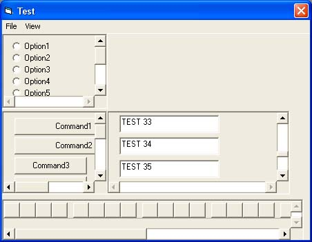



## DVBPanel

### Description

Formerly: IsPanel With Mouse Wheel Support

This is a complete rewrite of my original code posted here.

http://www.planetsourcecode.com/vb/scripts/ShowCode.asp?txtCodeId=59863&lngWId=1

Similar to Java's JPanel this control allows you to add scroll bars to a form easily.

Supports Mouse Wheel, while tabbing through controls will keep the active control in current view.

DVBPanel is also now a container so no need to write any code in your form to support this control.

Works best as a compiled OCX however will run fine if just added to your application.
 
### More Info
 

             |
---                |---
**Submitted On**   |2005-04-09 22:06:44
**By**             |[DavidJ](https://github.com/Planet-Source-Code/PSCIndex/blob/master/ByAuthor/davidj.md)
**Level**          |Intermediate
**User Rating**    |5.0 (15 globes from 3 users)
**Compatibility**  |VB 5\.0, VB 6\.0
**Category**       |[VB function enhancement](https://github.com/Planet-Source-Code/PSCIndex/blob/master/ByCategory/vb-function-enhancement__1-25.md)
**World**          |[Visual Basic](https://github.com/Planet-Source-Code/PSCIndex/blob/master/ByWorld/visual-basic.md)
**Archive File**   |[DVBPanel187470492005\.zip](https://github.com/Planet-Source-Code/davidj-dvbpanel__1-59922/archive/master.zip)

